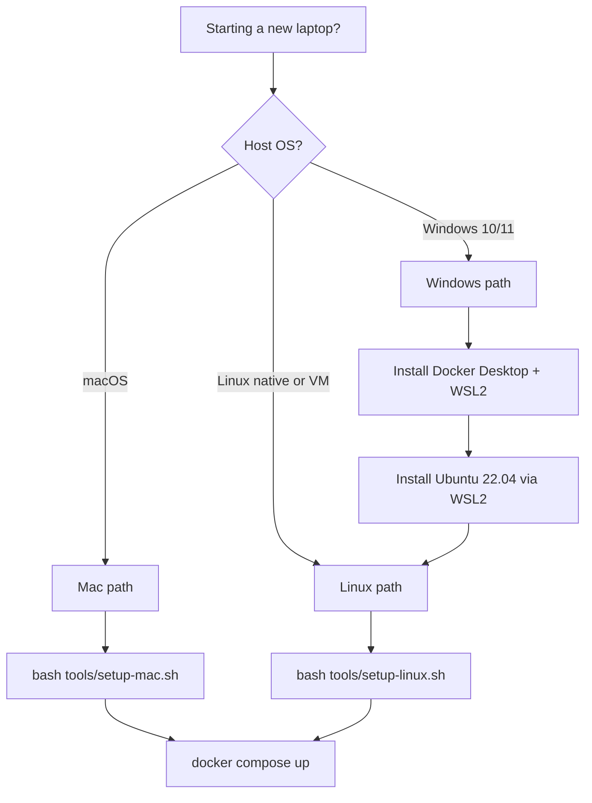

# Dev environment setup

This is the entry point for a new contributor getting their laptop ready to
work on POSEIDON MVP. Runtime differences between macOS, Linux, and Windows
are resolved by containers - the actual runtime is always Ubuntu 22.04 /
24.04 inside Docker. The host only needs Docker plus a small CLI toolbelt
for linting and local Helm tests.

## Supported host platforms

| Platform | Runtime | Supported | Notes |
| --- | --- | --- | --- |
| macOS 14+ on Apple Silicon (M1-M4) | Docker Desktop (ARM64 containers) | Yes - primary | Daily dev. Stonefish + GPU runs happen on the shared cloud box, not on the Mac. |
| macOS 14+ on Intel | Docker Desktop (amd64 containers) | Yes | Same as Apple Silicon except amd64. |
| Ubuntu 22.04 / 24.04 | Docker Engine | Yes - primary | Matches the deploy target. NVIDIA optional for local GPU work. |
| Debian 12, Pop!_OS, Linux Mint | Docker Engine | Yes | Same as Ubuntu (apt path). |
| Fedora, RHEL 9, Rocky 9, Alma 9 | Docker Engine | Yes | dnf path in the setup script. |
| Windows 10/11 + WSL2 Ubuntu | Docker Desktop (WSL2 backend) | Yes | Treat as Linux inside WSL2. |
| Windows native (no WSL2) | n/a | **No** | ROS 2 Windows is flaky; Stonefish has no Windows build. Use WSL2. |
| Chromebook (ChromeOS Linux dev env) | Docker in Crostini | Best effort | Works for lint-only work; no GPU / heavy sim. |

## Choose your path



---

## Mac path (macOS 14+)

### Prerequisites you install manually

These are GUI installers, not handled by the script:

1. **Docker Desktop for Mac** - https://docs.docker.com/desktop/install/mac-install/
   Open the app once, accept the license, and bump resources under
   `Settings > Resources`:
   - CPUs: at least 8
   - Memory: at least 12 GB
   - Disk image size: at least 80 GB (MCAP recordings get big)
2. **Unreal Engine 5.4** (only if you work on rendering) -
   https://www.unrealengine.com/en-US/download via Epic Games Launcher.

### Run the script

```bash
cd poseidon-mvp
bash tools/setup-mac.sh
```

The script installs via Homebrew: `git`, `git-lfs`, `gh`, `helm`, `kubectl`,
`k3d`, `yamllint`, `uv`, `pre-commit`, VS Code + extensions, Foxglove
Studio. It then runs `docker compose config --quiet`, `helm lint`, and
`uv lock --check` to verify the repo is healthy.

Re-run `bash tools/setup-mac.sh` any time; it is idempotent.

Check-only mode (no changes): `bash tools/setup-mac.sh --check`.

---

## Linux path (Ubuntu / Debian / RHEL family)

### Prerequisites

None you install manually. The script handles Docker Engine installation
through Docker's official repos.

If your machine has an NVIDIA GPU and you need local GPU work: install the
NVIDIA driver and Container Toolkit separately. See
`docs/runbooks/cloud-demo-box.md` for the Ubuntu 24.04 + RTX 4090 path.

### Run the script

```bash
cd poseidon-mvp
bash tools/setup-linux.sh
```

Auto-detects Ubuntu / Debian / Pop / Mint (apt) vs Fedora / RHEL / Rocky
/ Alma (dnf). Installs: Docker Engine + Compose plugin, `git`, `git-lfs`,
`gh`, `helm`, `kubectl`, `k3d`, `yamllint`, `uv`. Runs the same project
verification as the Mac script.

If the script adds you to the `docker` group, **log out and log back in**
before running `docker compose up`.

Check-only mode: `bash tools/setup-linux.sh --check`.

---

## Windows path (via WSL2)

Windows native is not supported. The supported path is WSL2 Ubuntu, which
Microsoft and Docker both treat as first-class.

### One-time setup (in Windows host, PowerShell as admin)

1. **Enable WSL2 and install Ubuntu 22.04:**
   ```powershell
   wsl --install -d Ubuntu-22.04
   ```
   Reboot when prompted. On first launch, set a UNIX username and password.
2. **Install Docker Desktop for Windows** -
   https://docs.docker.com/desktop/install/windows-install/
   During install select "Use WSL 2 instead of Hyper-V" and, after install,
   open `Settings > Resources > WSL Integration` and enable integration for
   your Ubuntu-22.04 distro.
3. **Install Windows Terminal** (optional but recommended) from the
   Microsoft Store. Set Ubuntu-22.04 as the default profile.
4. **Install VS Code** - https://code.visualstudio.com/ - plus the
   `Remote - WSL` extension. Open the repo with `code .` from inside WSL.

### Then inside WSL2 Ubuntu

```bash
# Clone the repo into your WSL2 home, NOT /mnt/c - WSL filesystem is ~10x
# faster than the Windows filesystem for Docker bind mounts.
mkdir -p ~/src && cd ~/src
git clone <repo-url> poseidon-mvp
cd poseidon-mvp

bash tools/setup-linux.sh
```

The Linux script detects WSL2 (`grep microsoft /proc/version`) and skips
Docker Engine installation, since Docker Desktop already provides the
daemon via its WSL integration.

### Windows-specific gotchas

- **Line endings.** Set `git config --global core.autocrlf input` in WSL2
  Ubuntu so Bash scripts keep LF.
- **Clock drift.** WSL2 sometimes drifts after Windows sleep; run
  `sudo hwclock -s` if `docker compose up` complains about TLS timestamps.
- **Performance.** Keep the repo under `~/` in WSL2, not on a `/mnt/c`
  path. Bind-mount speed is day and night.
- **GPU passthrough.** WSL2 CUDA works on Windows 11 with recent NVIDIA
  drivers, but this is separate from the shared cloud box. See
  https://docs.nvidia.com/cuda/wsl-user-guide/ if you have a local NVIDIA
  GPU.

---

## Verifying any platform

Once setup finishes, these commands should succeed from the repo root:

```bash
docker version
docker compose -f deploy/compose/docker-compose.yml config --quiet
helm lint charts/poseidon-platform
uv lock --check
```

If all four pass, you are ready. Next step: `docker compose -f
deploy/compose/docker-compose.yml --profile core up`.

---

## When to ask for help

- `docker compose config` fails with a YAML error after pulling main:
  run `git pull --rebase origin main` and re-run.
- `uv lock --check` says the lock needs updating: someone added a Python
  dep; run `uv lock` and commit the diff in a follow-up PR.
- `helm lint` fails: someone broke the Helm chart; paste the error in
  the team chat.
- Docker Desktop on Windows hangs on startup: restart WSL2 via
  `wsl --shutdown` from PowerShell, then reopen Docker Desktop.

## Related runbooks

- [`cloud-demo-box.md`](cloud-demo-box.md) - shared Linux + NVIDIA GPU box
  for Stonefish, full-fidelity Unreal, and the determinism regression
  suite.
- [`../architecture/`](../architecture/) - ADRs explaining why we chose the
  tools we chose.
